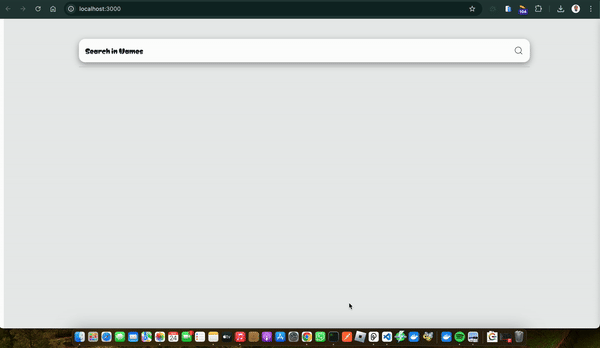

## Sneak Peek



# React Prompt Search

## Description

> This project is a simple React application that allows users to search for data fetched from an external API. The app dynamically filters and displays search results as the user types into the search bar.

## Live Demo Link

[Project Live Link](https://react-prompt-search-mob9kyy74-white3ds-projects.vercel.app/)

## Built With


## Get Started

### Run

```
To get a clone of the project, run `https://github.com/odhiambo-ed/react-prompt-search.git`
```

```
cd /react-prompt-search
```

```
npm install
```

```
npm run dev
```


## Author(s)

  <a href="https://github.com/odhiambo-ed" target="blank"></a>   **Edward Odhiambo**

- GitHub: [@whit3d](https://github.com/odhiambo-ed)
- Twitter: [@odhiambo_ed](https://twitter.com/odhiambo_ed)
- LinkedIn: [Edward Odhiambo](https://www.linkedin.com/in/edward-odhiambo/)
- Portfolio: [Edward Odhiambo](https://edwardodhiambo.com/)

## 🤝 Contributing

Contributions, issues, and feature requests are welcome!!!

Feel free to check the [issues page]https://github.com/odhiambo-ed/react-prompt-search/issues)

## Show your support

Give a ⭐️ if you like this project!

## Acknowledgments

- Hat tip to anyone whose code was used
- Special thanks to [React](https://react.dev/) for the amazing vanilla JavaScript framework project. I am grateful for your talent and generosity in sharing your work with the community.

## 📝 License

This project is [MIT](https://github.com/white3d/GitHub-User-Content/blob/main/LICENSE) licensed.

